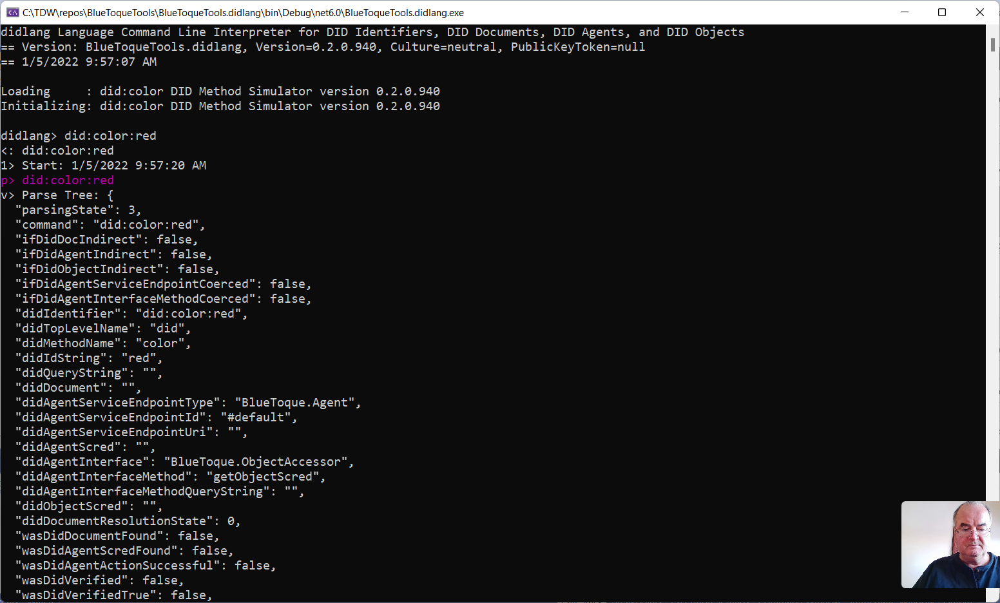

# BlueToque Tools Toolkit
Trusted Digital Web (TDW) Project, Hyperonomy Digital Identity Lab, Parallelspace Corporation

BlueToque Tools is a collection of software tools for working with DID Method Namespaces, DID Identifiers, DID Documents, DID Agent Service Endpoints, DID Agent Servers, DID Agent Clusters, and DID Objects (the _7 DIDs_). The flagship tool is `didlang`, a language for interactively working with the _7 DIDs_.

The collection of BlueToque Tools includes a collection of software utilities, prototype apps, proof-of-concept (PoC) apps, and demonstration apps used to support, validate, and/or demonstrate key features of
the BlueToque family of Fully Decentralized Object (FDO) Framework specifications.


## Contents

- `didlang` Language Command Line Interpreter for DID Method Namespaces, DID Identifiers, DID Documents, DID Agent Service Endpoints, DID Agent Servers, DID Agent Clusters, and DID Objects version 0.4

## didlang Language Command Line Interpreter for DID Method Namespaces, DID Identifiers, DID Documents, DID Agent Service Endpoints, DID Agent Servers, DID Agent Clusters, and DID Objects version 0.4

`didlang` is a new interpreted, command line language for working with DID Method Namespaces, DID Identifiers, DID Documents, DID Agent Service Endpoints, DID Agent Servers, DID Agent Clusters, and DID Objects (the _7 DIDs_).

Video tutorial: [#didlang 0.3 Interpreter for DID Identifiers, DID Documents, DID Agent Clusters, and DID Objects](https://www.youtube.com/watch?v=mf0aKLvJoCw&list=PLU-rWqHm5p45RKAAF8bleTuPNI5cBE3gP&index=1)

### didlang Conceptual Model


### Commands

#### Help Commands

- Enter `help` to display the list of top-level commands.
- Enter `!help` to display a list of command shortcuts.

#### Create Commands (+ Add Operator)

- Enter `+did:<method name>` to register a new DID Method name - fails if the DID Method name was registered previously.
- Enter `+did:<method name>:<idstring>` to register a DID Document with a (default) `Bluetoque.Compute.Agent` serviceEndpoint url,
a (default) `Bluetoque.Storage.Agent` serviceEndpoint url, and a (default) `Bluetoque.Verify.Agent` serviceEndpoint url - fails if a DID Document is already asssociated with this DID Identifier. Optionally, a payload consisting of a fully formed and complete DID Document with a matching DID Identifier can be submitted with this Create command.
- Enter `++did:<method name>:<idstring> type="<type>"` to deploy a new DID Agent onto an DID Agent Host(s) with a serviceEndPoint url which a matching type - fails if the DID Agent has previously been deployed
- Enter `+++did:<method name>:<idstring> "[Name1"="Value1" ...]` to create a new DID Object (Structure Credential) (associated with the DID Identifier) on a DID Storage Agent with an optional set of claims (name-value pairs) - fails if the DID Object already exists.

#### Verify Commands (No Operator)

- Enter `<did>` to verify a DID Identifier (no indirection or other operator).

#### Read Commands (* Indirection Operator)

- Enter `*<did>` to return the DID Document associated with the DID Identifier ("single indirection").
- Enter `**<did>` to returns a Swagger API definition (or equivalent) for the DID Agent with a matching type 
associated with the DID Identifier ("double indirection").
- Enter `***<did>` to return the value of the DID Object  
associated with the DID Identifier as a Structured Credential ("triple indirection").
- Enter `***<did> "Name1" ...` to return selected property values (claims) from the DID Object associated with the DID Identifier as a Structured Credential ("triple indirection").

#### Example 1:  Swagger API definition (or equivalent) of a the DID Agent: Swagger
```json
{
  "openapi": "3.0.1",
  "info": {
    "title": "defaultTitle",
    "description": "defaultDescription",
    "version": "0.1"
  },
  "servers": [
    {
      "url": "http://localhost:8081"
    }
  ],
  "paths": {
    "/SendNFEEnvelopeToStorage/": {
      "post": {
        "description": "Auto generated using Swagger Inspector",
        "requestBody": {
          "content": {
            "application/json": {
              "schema": {
                "$ref": "#/components/schemas/SendNFEEnvelopeToStorage_body"
              },
              "examples": {}
            }
          }
        },
        "responses": {
          "200": {
            "description": "Auto generated using Swagger Inspector",
            "content": {
              "application/json": {
                "schema": {
                  "$ref": "#/components/schemas/inline_response_200"
                },
                "examples": {
                  "0": {
                    "value": "{\"rc\":0}"
                  }
                }
              }
            }
          }
        },
        "servers": [
          {
            "url": "http://localhost:8081"
          }
        ]
      },
      "servers": [
        {
          "url": "http://localhost:8081"
        }
      ]
    }
  },
  "components": {
    "schemas": {
      "SendNFEEnvelopeToStorage_sealedEnvelope_envelope_label": {
        "type": "object",
        "properties": {
          "encryptionFlag": {
            "type": "string"
          },
          "types": {
            "type": "array",
            "items": {
              "type": "string"
            }
          },
          "credtype": {
            "type": "string"
          },
          "comments": {
            "type": "array",
            "items": {
              "type": "string"
            }
          },
          "name": {
            "type": "string"
          },
          "trustLevel": {
            "type": "string"
          },
          "version": {
            "type": "integer"
          }
        },
        "example": null
      },
      "SendNFEEnvelopeToStorage_sealedEnvelope_envelope_content_credentialsubjectclaims": {
        "type": "object",
        "properties": {
          "n0samples": {
            "type": "integer"
          },
          "tod5finish": {
            "type": "string"
          },
          "d4recoverytime": {
            "type": "array",
            "items": {
              "type": "integer"
            }
          },
          "d3s": {
            "type": "integer"
          },
          "n2samples": {
            "type": "integer"
          },
          "kissCompass": {
            "type": "integer"
          },
          "n1samples": {
            "type": "integer"
          },
          "n3samples": {
            "type": "integer"
          },
          "n4samples": {
            "type": "integer"
          },
          "t3ms": {
            "type": "integer"
          },
          "t5ms": {
            "type": "integer"
          },
          "t3s": {
            "type": "integer"
          },
          "t1ms": {
            "type": "integer"
          },
          "d5ms": {
            "type": "integer"
          },
          "d3ms": {
            "type": "integer"
          },
          "d1ms": {
            "type": "integer"
          },
          "d4s": {
            "type": "integer"
          },
          "tod1press": {
            "type": "string"
          },
          "d0approachtime": {
            "type": "array",
            "items": {
              "type": "integer"
            }
          },
          "tod3release": {
            "type": "string"
          },
          "d4recoverycurve": {
            "type": "array",
            "items": {
              "type": "integer"
            }
          },
          "t4s": {
            "type": "integer"
          },
          "t0s": {
            "type": "integer"
          },
          "tod2sustain": {
            "type": "string"
          },
          "medians": {
            "type": "integer"
          },
          "tod4recovery": {
            "type": "string"
          },
          "d5s": {
            "type": "integer"
          },
          "d2sustaintime": {
            "type": "array",
            "items": {
              "type": "integer"
            }
          },
          "mood": {
            "type": "string"
          },
          "purpose": {
            "type": "string"
          },
          "tongue": {
            "type": "boolean"
          },
          "d1s": {
            "type": "integer"
          },
          "d3releasecurve": {
            "type": "array",
            "items": {
              "type": "integer"
            }
          },
          "d3releasepng64": {
            "type": "string"
          },
          "t2ms": {
            "type": "integer"
          },
          "d2sustainpng64": {
            "type": "string"
          },
          "t4ms": {
            "type": "integer"
          },
          "t5s": {
            "type": "integer"
          },
          "actualbodypart": {
            "type": "string"
          },
          "d2sustaincurve": {
            "type": "array",
            "items": {
              "type": "integer"
            }
          },
          "t0ms": {
            "type": "integer"
          },
          "t1s": {
            "type": "integer"
          },
          "d4ms": {
            "type": "integer"
          },
          "timezoneid": {
            "type": "string"
          },
          "d4recoverypng64": {
            "type": "string"
          },
          "d2ms": {
            "type": "integer"
          },
          "d1presstime": {
            "type": "array",
            "items": {
              "type": "integer"
            }
          },
          "kissType": {
            "type": "string"
          },
          "coverage": {
            "type": "integer"
          },
          "d2s": {
            "type": "integer"
          },
          "d1presscurve": {
            "type": "array",
            "items": {
              "type": "integer"
            }
          },
          "peak": {
            "type": "integer"
          },
          "targetbodypart": {
            "type": "string"
          },
          "d0approachcurve": {
            "type": "array",
            "items": {
              "type": "integer"
            }
          },
          "t2s": {
            "type": "integer"
          },
          "d1presspng64": {
            "type": "string"
          },
          "d0approachpng64": {
            "type": "string"
          },
          "tod0approach": {
            "type": "string"
          },
          "d3releasetime": {
            "type": "array",
            "items": {
              "type": "integer"
            }
          },
          "medianms": {
            "type": "integer"
          }
        },
        "example": null
      },
      "SendNFEEnvelopeToStorage_sealedEnvelope_envelope_content": {
        "type": "object",
        "properties": {
          "credentialsubjectclaims": {
            "$ref": "#/components/schemas/SendNFEEnvelopeToStorage_sealedEnvelope_envelope_content_credentialsubjectclaims"
          },
          "context": {
            "type": "array",
            "items": {
              "type": "string"
            }
          },
          "credentialsubjectudid": {
            "type": "string"
          },
          "udid": {
            "type": "string"
          }
        },
        "example": null
      },
      "SendNFEEnvelopeToStorage_sealedEnvelope_envelope": {
        "type": "object",
        "properties": {
          "label": {
            "$ref": "#/components/schemas/SendNFEEnvelopeToStorage_sealedEnvelope_envelope_label"
          },
          "udid": {
            "type": "string"
          },
          "content": {
            "$ref": "#/components/schemas/SendNFEEnvelopeToStorage_sealedEnvelope_envelope_content"
          }
        },
        "example": null
      },
      "SendNFEEnvelopeToStorage_sealedEnvelope_proof": {
        "type": "object",
        "properties": {
          "hashedThumbprint64": {
            "type": "string"
          },
          "comments": {
            "type": "array",
            "items": {
              "type": "string"
            }
          }
        },
        "example": null
      },
      "SendNFEEnvelopeToStorage_sealedEnvelope": {
        "type": "object",
        "properties": {
          "envelope": {
            "$ref": "#/components/schemas/SendNFEEnvelopeToStorage_sealedEnvelope_envelope"
          },
          "proof": {
            "$ref": "#/components/schemas/SendNFEEnvelopeToStorage_sealedEnvelope_proof"
          }
        },
        "example": null
      },
      "SendNFEEnvelopeToStorage_body": {
        "type": "object",
        "properties": {
          "sealedEnvelope": {
            "$ref": "#/components/schemas/SendNFEEnvelopeToStorage_sealedEnvelope"
          }
        }
      },
      "inline_response_200": {
        "type": "object",
        "properties": {
          "rc": {
            "type": "integer"
          }
        }
      }
    }
  }
}
```

#### Example 2:  Swagger API definition (or equivalent) a the DID Agent: Alternate
```json
{
    "endpoints": [
        {
            "address": "http://localhost:8081/SendNFEEnvelopeToStorage/",
            "requestType": "json",
            "requestParameters": [
                "sealedEnvelope"
            ],
            "responseType": "json",
            "responseParameters": [
                "rc"
            ]
        }
    ]
}
```

#### Update Commands (^ Update (Merge) Operator)

- Enter `^did:<method name>:<idstring> type=clustered,roundrobin,BlueToque.Agent agents=<N>` to add a new serviceEndpoint to an existing DID DOcument associated with the DID Identifier - fails if a DID Document associated with this DID Identifier doesn't exist
- Enter `^^did:<method name>:<idstring> type=clustered,roundrobin,BlueToque.Agent agents=<N>` redeploy a DID Agent(s) to the DID Agent Host associated with the serviceEndpoint in an existing DID DOcument associated with the DID Identifier - fails if a DID Document associated with this DID Identifier doesn't exist or the designated serverEndpoint does't exist in the DID Document
- Enter `^^^did:<method name>:<idstring> "Name1"="Value1" ...` to add or update one or more named properties (claims) in a DID Object[1].

#### Delete Commands (- Remove Operator)

- Enter `-did:<method name>` to deregister a new DID Method name - fails if the DID Method namespace contains existing
DID Documents, DID Agents, or DID Objects.
- Enter `-did:<method name>:<idstring>` to delete an existing DID Document and an associated DID Agent and DID Object (Structured Credentials) (aka DID Chain), if they exist
- Enter `--did:<method name>:<idstring>  type=clustered,roundrobin,BlueToque.Agent agents=<N>` to uninstall an existing DID Agent from the DID Agent Host associated with the serviceEndpoint in the DID object associated DID Object, if they exist.
- Enter `---did:<method name>:<idstring>` to delete from DID Storage an existing DID Object (the entire DID Object) - including all contained named properties (claims).
- Enter `---did:<method name>:<idstring> "Name1" ...` to delete one or more named properties (claims) from an existing DID Object[1]. 

#### Advanced Commands (Coercion Operator)

- To override the default selectors for the Agent service endpoint and/or the Agent interface and interface method to be called (selector coercion), enter
```
*(serviceEndpointType^serviceEndpointId)*did
```
returns Agent Scred for an alternative Agent service endpoint in the DID Document.
```
**(serviceEndpointType^serviceEndpointId)*did
```
returns result of calling the default interface method on an alternative Agent service endpoint in the DID Document.
```
*(agentInterface:agentMethod)**did
```
returns the result of calling an alternative interface method on the default DID Agent Cluster service endpoint.
```
*(agentInterface^agentMethod)*(serviceEndpointType^serviceEndpointId)*did
```
returns the result of calling an alternative interface method on an alternative DID Agent Cluster service endpoint in the DID Document (double coercion).

### Command Shortcuts

```
- !0      = did:example:1234
- !r      = did:color:red
- !1      = *did:color:red
- !2      = **did:color:red
- !3      = ***did:color:red
- !red    = ***did:example:red
- !green  = ***did:example:green
- !blue   = ***did:example:blue
- !colors = display a list of the registered did:color DID Objects
```

### Screenshot



### Build

- Build `BlueToqueTools.sln` using a recent version of Visual Studio 2022.
- Click `Debug -> Start New Instance` to run 
the `didlang Language` command line interpreter.

## Context


Figure 1. Trusted Digital Web and the Decentralized (DID) OSI Model


Figure 2. Trusted Digital Web (TDW2022) Software Digital Ecosystem

## References

[1] Future versions of the `didlang` Create/Update and Delete command language syntax will evolve from:
```
++++did:<method name>:<idstring> Name1="Value1" ...
----did:<method name>:<idstring> Name1 ...
```
to also include:
```
+***did:<method name>:<idstring> Name1="Value1" ...
-***did:<method name>:<idstring> Name1 ...
```
That is, _indirection_ will be used to first read the DID Document, DID Agent, or DID Object entity;
then the `+` or `-` ooperator will then act appropriately on the returned entity (as defined above).
